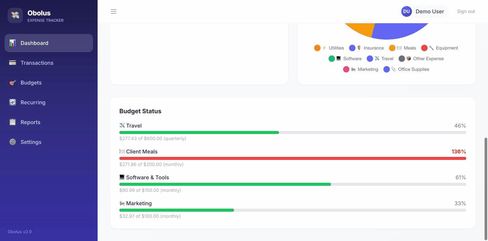

# Obolus

A best-in-class expense tracker built for freelancers. Track income and expenses, manage budgets, generate tax reports, and stay on top of your finances.



## Features

- **Transaction Management** — Full CRUD for income and expenses with filtering, sorting, search, and pagination
- **Dashboard** — Summary cards, income vs expense trend charts, category breakdown doughnut chart, budget progress bars
- **Budget Tracking** — Per-category budgets with configurable periods (monthly, quarterly, yearly) and real-time warnings at 80%/100% thresholds
- **Recurring Transactions** — Automated transaction creation on configurable schedules (daily to yearly)
- **Multi-Currency** — 30+ currencies with live exchange rates from the ECB via frankfurter.app
- **Tax Reports** — Annual tax summary with deductible expense breakdown, quarterly view, and CSV/PDF export
- **Receipt Uploads** — Attach JPEG, PNG, WebP, or PDF receipts to any transaction
- **Settings** — Profile management, default currency, password change

## Tech Stack

| Layer | Technology |
|-------|-----------|
| Backend | Express 4, TypeScript, Prisma ORM, SQLite |
| Frontend | Vue 3 (Composition API), TypeScript, Pinia, Tailwind CSS, Chart.js |
| Auth | JWT access + refresh tokens with rotation, bcrypt |
| Validation | Zod (backend), HTML5 + client-side (frontend) |
| Testing | Vitest, Supertest, Vue Test Utils |
| Infrastructure | Docker Compose, GitHub Actions CI |

## Quick Start

### Prerequisites
- Node.js 20+
- npm 9+

### Development

```bash
# Clone and install
git clone https://github.com/dnakitare/obolus.git
cd obolus

# Backend setup
cd packages/backend
cp .env.example .env
npm install
npx prisma generate
npx prisma migrate dev
npm run db:seed    # Creates demo user: demo@obolus.dev / password123
npm run dev        # Starts on http://localhost:3000

# Frontend setup (new terminal)
cd packages/frontend
npm install
npm run dev        # Starts on http://localhost:5173
```

### Docker

```bash
docker compose up --build
# Frontend: http://localhost:8080
# Backend API: http://localhost:3000
```

## API

All endpoints are prefixed with `/api/v1`. Authenticated routes require `Authorization: Bearer <token>`.

| Resource | Endpoints |
|----------|-----------|
| Auth | `POST /auth/register, /auth/login, /auth/refresh, /auth/logout` `GET /auth/me` `PATCH /auth/me, /auth/password` |
| Transactions | `GET /transactions` `GET /transactions/:id` `POST /transactions` `PATCH /transactions/:id` `DELETE /transactions/:id` |
| Categories | `GET /categories` `POST /categories` `PATCH /categories/:id` `DELETE /categories/:id` |
| Budgets | `GET /budgets` `POST /budgets` `PATCH /budgets/:id` `DELETE /budgets/:id` |
| Recurring | `GET /recurring` `POST /recurring` `POST /recurring/process` `PATCH /recurring/:id` `DELETE /recurring/:id` |
| Dashboard | `GET /dashboard/summary, /dashboard/trends, /dashboard/by-category, /dashboard/budget-status` |
| Reports | `GET /reports/tax-summary, /reports/export/csv, /reports/export/pdf` |
| Receipts | `POST /transactions/:id/receipt` `GET /transactions/:id/receipt` `DELETE /transactions/:id/receipt` |
| Currencies | `GET /currencies` `GET /currencies/rate` |

## Project Structure

```
obolus/
├── packages/
│   ├── backend/          # Express API
│   │   ├── prisma/       # Schema, migrations, seed
│   │   └── src/
│   │       ├── config/   # Zod-validated env
│   │       ├── middleware/# Auth, validation, rate limiting, uploads, errors
│   │       ├── routes/   # Express routers
│   │       ├── controllers/
│   │       ├── services/ # Business logic
│   │       ├── schemas/  # Zod input schemas
│   │       ├── lib/      # Prisma client, JWT helpers, PDF generator
│   │       └── jobs/     # Recurring transaction processor (node-cron)
│   └── frontend/         # Vue 3 SPA
│       └── src/
│           ├── pages/    # Route-level components
│           ├── components/# UI, layout, feature components
│           ├── stores/   # Pinia state management
│           ├── api/      # Axios API modules
│           ├── composables/# Reusable logic (currency, toasts)
│           └── types/    # TypeScript interfaces
├── docker/               # Dockerfiles, nginx config
├── .github/workflows/    # CI pipeline
└── docker-compose.yml
```

## License

MIT
